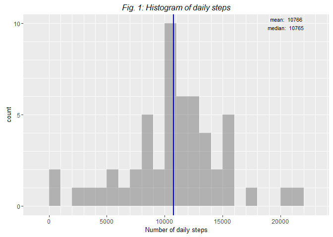
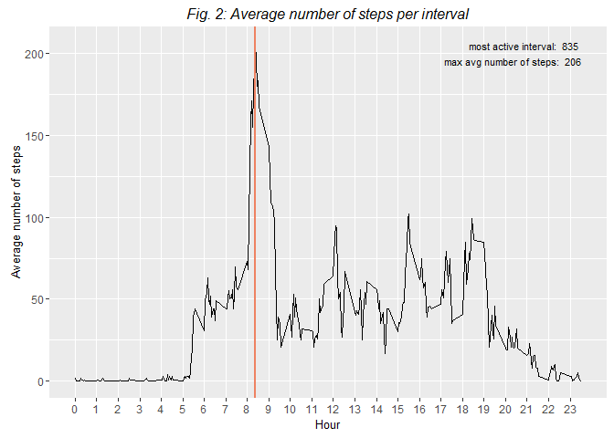
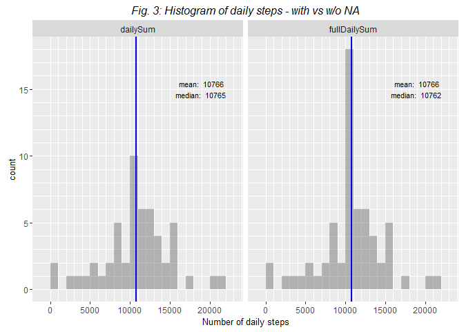
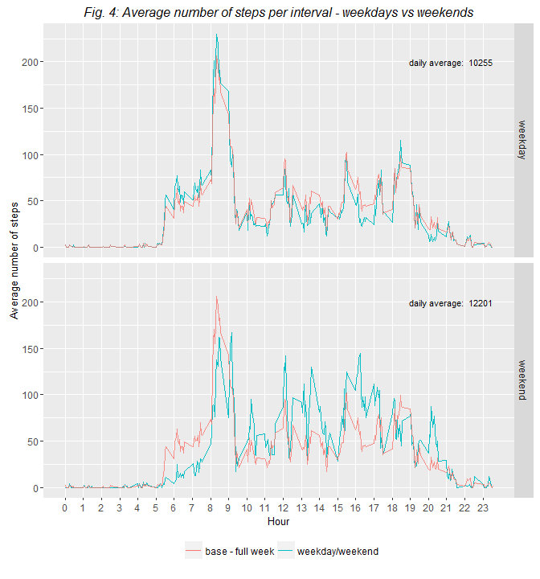

# Untitled
Sebastien Plat  
19 février 2016  


## Introduction

### Context

It is now possible to collect a large amount of data about personal movement using activity monitoring devices such as a Fitbit, Nike Fuelband, or Jawbone Up. These type of devices are part of the "quantified self" movement - a group of enthusiasts who take measurements about themselves regularly to improve their health, to find patterns in their behavior, or because they are tech geeks. But these data remain under-utilized both because the raw data are hard to obtain and there is a lack of statistical methods and software for processing and interpreting the data.

This assignment makes use of data from a personal activity monitoring device, which collects data at **5 minute intervals** through out the day. It can be downloaded [here](https://d396qusza40orc.cloudfront.net/repdata%2Fdata%2Factivity.zip). 

### Data Overview

The data consists of:

+ **two months of data** from an anonymous individual
+ collected during the months of **October and November, 2012**
+ with the **number of steps** taken in **5 minute intervals** each day


The variables included in this dataset are:

+ **steps**: Number of steps taking in a 5-minute interval (missing values are coded as NA)
+ **date**: The date on which the measurement was taken in YYYY-MM-DD format
+ **interval**: Identifier for the 5-minute interval in which measurement was taken

The dataset is stored in a comma-separated-value (CSV) file with a total of 17,568 observations.
duplicated(c(1,2,3,1))

### Loading libraries


```r
library(dplyr)
library(ggplot2)
library(reshape2)
```

\  

## 1. Loading and preprocessing the data

### Loading


```r
activity <- read.csv("activity.csv")
activity$intervalFactor <- factor (activity$interval)
```

\  

### First look

Before going further, let's have a first look at the data. We have:
 
+ **61** days
+ **288** intervals, from 0 to 2355
+ Intervals show the time of day with format **HHmm**: we jump from "55" to "100", from "155" to "200", etc.
 
+ **All recorded days have 288 unique interval values**
+ **Each day either has 288 NA values or not at all**
+ Only **8 days** out of 61 have no measures.

\  


```r
# look at the number of factors
str(activity)
```

```
## 'data.frame':	17568 obs. of  4 variables:
##  $ steps         : int  NA NA NA NA NA NA NA NA NA NA ...
##  $ date          : Factor w/ 61 levels "2012-10-01","2012-10-02",..: 1 1 1 1 1 1 1 1 1 1 ...
##  $ interval      : int  0 5 10 15 20 25 30 35 40 45 ...
##  $ intervalFactor: Factor w/ 288 levels "0","5","10","15",..: 1 2 3 4 5 6 7 8 9 10 ...
```

```r
# look at interval values more closely
head (activity$intervalFactor, 25)
```

```
##  [1] 0   5   10  15  20  25  30  35  40  45  50  55  100 105 110 115 120
## [18] 125 130 135 140 145 150 155 200
## 288 Levels: 0 5 10 15 20 25 30 35 40 45 50 55 100 105 110 115 120 ... 2355
```

```r
# check if some days have more or less than 288 intervals
print.data.frame(group_by(activity, date) %>% filter (n()!=288)) # returns empty df
```

```
## [1] steps          date           interval       intervalFactor
## <0 rows> (or 0-length row.names)
```

```r
# check if some intervals are duplicated
print.data.frame(group_by(activity, date, interval) %>% filter (n()>1)) # returns empty df
```

```
## [1] steps          date           interval       intervalFactor
## <0 rows> (or 0-length row.names)
```

```r
# count the number of NA values per day
naCount <- group_by(activity, date) %>% summarize (n=length(which(is.na(steps))))
table(naCount$n)
```

```
## 
##   0 288 
##  53   8
```


\  

## 2. What is mean total number of steps taken per day?

Fig.1 shows the histogram of daily steps, excluding the 8 days without data. 
Calculations show that **mean = median = 10765 steps/day**.

\  


```r
# build daily synthesis & filter the 8 empty days
dailyActivity <- group_by(activity, date) %>%
                 summarize(dailySum=sum(steps)) %>%
                 filter (!is.na(dailySum))

# calculate mean & median
dailyMean <- round(mean (dailyActivity$dailySum, na.rm = TRUE))
dailyMedian <- round(median(dailyActivity$dailySum, na.rm = TRUE))

# prepare daily steps counts
g = qplot(dailyActivity$dailySum, geom = 'blank') + geom_histogram(binwidth = 1000, alpha=0.4)

# update tick marks
g = g + scale_x_continuous(minor_breaks = seq(0, 25000, 1000), breaks = seq(0, 25000, 5000)) +
        scale_y_continuous(minor_breaks = seq(0, 15, 1), breaks = seq(0, 15, 5))

# add title & theme
g = g + xlab("Number of daily steps") +
        ggtitle ("Fig. 1: Histogram of daily steps") +
        theme(title=element_text(size = 10, colour = 'black'),
        plot.title=element_text(face='italic', vjust=2))

# fig.1: mean & median vertical lines + annotate
g = g + geom_vline (xintercept=dailyMean, color='salmon2', lwd=1)
g = g + geom_vline (xintercept=dailyMedian, color='blue2', lwd=1)

g = g + annotate("text", x = 22000, y = 10, hjust = 1, size=3,
                   label = paste("mean: ", dailyMean,
                                 "\nmedian: ", dailyMedian))

g
```




\  

## 3. What is the average daily activity pattern?

Fig.2 shows the average daily activity pattern. On average, **the most active interval is between 8:35AM and 8:40PM**,
with **206 steps**.

\  


```r
# build interval synthesis 
intervalActivity <- group_by(activity, interval) %>%
                    summarize(intervalMean=round(mean(steps, na.rm = TRUE)))

# calculate most active interval
mostActiveInterval <- intervalActivity[which.max(intervalActivity$intervalMean),]$interval
mostNumberOfSteps <- intervalActivity[which.max(intervalActivity$intervalMean),]$intervalMean

# show average number of steps per interval
g = ggplot(intervalActivity, aes(x=interval, y=intervalMean)) + geom_line() + ylab("Average number of steps")
g = g + scale_x_continuous(name = 'Hour', minor_breaks = NULL, breaks = seq(0, 2300, 100), labels = seq(0,23,1))

# most active interval - vertical line & annotate
g = g + geom_vline (xintercept=mostActiveInterval, color='salmon2', lwd=1)
g = g + annotate("text", x = 2355, y = 200, hjust = 1, size=3,
                   label = paste("most active interval: ", mostActiveInterval,
                                 "\nmax avg number of steps: ", mostNumberOfSteps))

# add title & theme
g = g + ggtitle ("Fig. 2: Average number of steps per interval") +
        theme(title=element_text(size = 10, colour = 'black'),
        plot.title=element_text(face='italic', vjust=2))
g
```




\  

## 4. Imputing missing values

As shown in 1., there are **8 days absolutely without data**. We will populate them with the **average for each interval**, that we calculated in 3.


```r
# we join the two tables, so we have access to the mean for each interval
fullActivity <- inner_join (x=activity, y=intervalActivity, by="interval")

# we populate the NA rows with the mean, and leave the rest unchanged
fullActivity <- mutate (fullActivity, fullSteps = ifelse (is.na(steps), intervalMean, steps))
```

\  

Fig.3 shows the comparizon between the initial seta of data and the ones where all NA values have been replaced. As we used the **average for each interval**, the additional 8 daily averages are equal to
the mean.  

+ **the mean is unchanged** when adding points located at the mean
+ **the median is unchanged as well**: adding points located at the mean does not skew the distribution


```r
# build the df for daily avg
fullDailyActivity <- group_by(fullActivity, date) %>%
                     summarize(dailySum=sum(steps), fullDailySum=sum(fullSteps))

# melt the result so we can ggplot both with/without NA with facets 
fullActivityMelt <- melt (fullDailyActivity, id.vars = "date")

# create a mean & median df
mean1 <- round(mean (fullActivityMelt[fullActivityMelt$variable=='dailySum', ]$value, na.rm = TRUE))
median1 <- round(median (fullActivityMelt[fullActivityMelt$variable=='dailySum', ]$value, na.rm = TRUE))
mean2 <- round(mean (fullActivityMelt[fullActivityMelt$variable=='fullDailySum', ]$value, na.rm = TRUE))
median2 <- round(median (fullActivityMelt[fullActivityMelt$variable=='fullDailySum', ]$value, na.rm = TRUE))

myMeanMedian <- data.frame(variable=levels(fullActivityMelt$variable), 
                           myMean=c(mean1,mean2),
                           myMedian=c(median1,median2))

# prepare daily steps counts
g = ggplot(fullActivityMelt, geom = 'blank') + facet_grid(. ~ variable) +
    geom_histogram(aes(x=value), binwidth = 1000, alpha=0.4)

# update tick marks
g = g + scale_x_continuous(minor_breaks = seq(0, 25000, 1000), breaks = seq(0, 25000, 5000)) +
        scale_y_continuous(minor_breaks = seq(0, 20, 1), breaks = seq(0, 20, 5))

# add title & theme
g = g + xlab("Number of daily steps") +
        ggtitle ("Fig. 3: Histogram of daily steps - with vs w/o NA") +
        theme(title=element_text(size = 10, colour = 'black'),
        plot.title=element_text(face='italic', vjust=2))

# mean & median vertical lines + annotate
g = g + geom_vline (aes(xintercept=myMean), color='salmon2', lwd=1, data=myMeanMedian)
g = g + geom_vline (aes(xintercept=myMedian), color='blue2', lwd=1, data=myMeanMedian)
  
g = g + geom_text(data = myMeanMedian, x = 22000, y = 15, hjust = 1, size=3,
                 aes(label = paste("mean: ", myMean,"\nmedian: ", myMedian)))
  

g
```




\  

## 5. Are there differences in activity patterns between weekdays and weekends?

Fig.4 shows the average daily activity pattern on weekdays vs weekends, compared to the
global average. We clearly see that the recorded person was **much more active on weekends**.

+ Weekday Daily Average: 10.255 steps
+ Weekend Daily Average: 12.200 steps, **+19% vs weekday**


_Note: we use the complete dataset, where the NA values have been replaced by the interval average._


```r
# we drop the columns we will not use
fullActivity <- select (fullActivity, date, interval, fullSteps)

# check if day is a weekday or weekend day
fullActivity$day <- ifelse (as.POSIXlt (activity$date, format="%Y-%m-%d")$wday == 0 | +
                            as.POSIXlt (activity$date, format="%Y-%m-%d")$wday == 6, "weekend", "weekday")

# build interval synthesis 
intervalActivity <- group_by(fullActivity, day, interval) %>%
                    summarize(intervalMean=round(mean(fullSteps)))

# build interval synthesis - all days 
intervalActivityAll <- group_by(fullActivity, interval) %>%
                       summarize(intervalMean=round(mean(fullSteps)))

# build weekday/weekend daily average
meanWD <- group_by(fullActivity, day, date) %>% summarize(dailySum=sum(fullSteps)) %>%
          group_by(day) %>% summarize(dailyAvg=round(mean(dailySum)))

dailyAverage <- data.frame(day=levels(factor(intervalActivity$day)), 
                           dailyAvg=c(meanWD[1,2][[1]],meanWD[2,2][[1]]))

# show average number of steps per interval
g = ggplot(intervalActivity, aes(x=interval, y=intervalMean)) + facet_grid(day ~ .)
g = g + geom_line(lwd=0.65, aes(colour='weekday/weekend')) + ylab("Average number of steps")
g = g + geom_line(lwd=0.5, data=intervalActivityAll, aes(y=intervalMean, colour='base - full week'), alpha=0.8)
g = g + scale_x_continuous(name = 'Hour', 
                           minor_breaks = NULL, 
                           breaks = seq(0, 2300, 100), labels = seq(0,23,1))

# add mean annotation
g = g + geom_text(data = dailyAverage, x = 2355, y = 200, hjust = 1, size=3,
                 aes(label = paste("daily average: ", dailyAvg)))

# add title & theme
g = g + ggtitle ("Fig. 4: Average number of steps per interval - weekdays vs weekends") +
        scale_colour_discrete(name=element_blank()) +
        theme(title=element_text(size = 10, colour = 'black'),
        plot.title=element_text(face='italic', vjust=2),
        legend.position='bottom')
g
```




