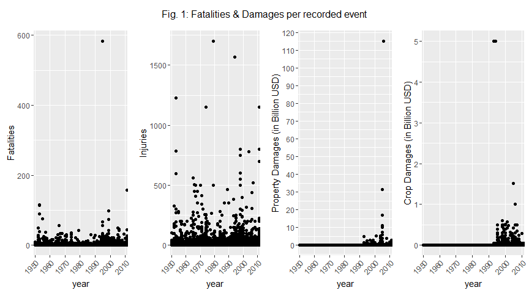
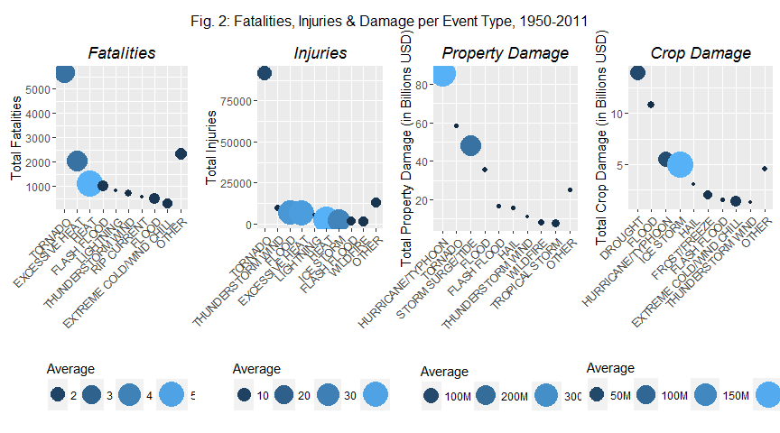

# Impact of severe wheather events on public health and ecomomy in the US
Sebastien Plat  


## Synopsis

Storms and other **severe weather events** can cause both public health and economic problems for communities and municipalities. Many severe events can result in fatalities, injuries, and property damage. Preventing such outcomes to the extent possible is a key concern.

This document will present the analysis of the U.S. National Oceanic and Atmospheric Administration's (NOAA) Storm Database, and its results regarding the following questions:

+ Across the US, which types of events are **most harmful** with respect to population health?
+ Across the US, which types of events have the **greatest economic consequences**?

The answer will show:

+ the **Top10 Event Types** for **fatalities and injuries, property damage and crop damage**
+ their **average impact** when harmful

The average impact will facilitate the **comparizon between Event Types with very different frequencies**.

_Note: this analysis was first done for the Reproducible Research Project. Its full version with all the code has been published on [Rpubs](http://rpubs.com/paulwasit/weatherEventsUS)._


## Loading Data

We start by downloading the data & reading it.


A brief look at the data frame shows more than 900k observations and 37 variables.


## Data Processing

We want to keep only the observations and variables that are relevant for this analysis: event type, fatalities and damage.

By looking at the documentation ([link](https://d396qusza40orc.cloudfront.net/repdata%2Fpeer2_doc%2Fpd01016005curr.pdf)), and especially section 2.7 p12, we can see there are two types of damage: property & crop. They are expressed with two variables:

+ DMP gives the amount
+ EXP gives the unit: thousands (K), millions (M) or billions (B)

This leads us to select only the following variables:


```r
# creating a year variable
storm$year <- factor(as.POSIXlt(strptime(as.character(storm$BGN_DATE), "%m/%d/%Y"))$year+1900)

# selecting fields relevant to the analysis
stormSelect <- select (storm, BGN_DATE, STATE, EVTYPE, FATALITIES, INJURIES, PROPDMG, PROPDMGEXP, CROPDMG, CROPDMGEXP, year)
```

### Cleaning damage costs

Table 1 and Table 2 show that **the damage unit is not always properly mentioned**: we expect only K, M and B (see above).


```
## 
##             -      ?      +      0      1      2      3      4      5 
##     76      1      0      5    209      0      1      1      4     18 
##      6      7      8      B      h      H      K      m      M 
##      3      2      0     40      1      6 227481      7  11319
```

```
## 
##           ?     0     2     B     k     K     m     M 
##     3     0    12     0     7    21 20137     1  1918
```

To adress this issue, we will:

+ consider **entries with incorrect damage units as having zero damage**
+ create new variables **prop_dmg** and **crop_dmg** that convert damages in USD


```r
# cleaning up property damages: we count them only if they have a proper unit
stormSelect <- mutate (stormSelect, prop_dmg = ifelse(PROPDMGEXP == "b" | PROPDMGEXP == "B", PROPDMG*10^9, 
                                               ifelse(PROPDMGEXP == "m" | PROPDMGEXP == "M", PROPDMG*10^6,
                                               ifelse(PROPDMGEXP == "k" | PROPDMGEXP == "K", PROPDMG*10^3, 0))))

# cleaning up crop damages: we count them only if they have a proper unit
stormSelect <- mutate (stormSelect, crop_dmg = ifelse(CROPDMGEXP == "b" | CROPDMGEXP == "B", CROPDMG*10^9, 
                                               ifelse(CROPDMGEXP == "m" | CROPDMGEXP == "M", CROPDMG*10^6,
                                               ifelse(CROPDMGEXP == "k" | CROPDMGEXP == "K", CROPDMG*10^3, 0))))
```

### Filtering Data

We will keep only the observations with either casualties or damage:


```r
# we drop all events that have neither fatalities/injuries nor damages
stormSelectFilter <- filter (stormSelect, FATALITIES > 0 | 
                                          INJURIES > 0 |
                                          prop_dmg > 0 | 
                                          crop_dmg > 0) %>% 
                     select (BGN_DATE, STATE, EVTYPE, 
                             FATALITIES, INJURIES,
                             PROPDMG, PROPDMGEXP,  prop_dmg, 
                             CROPDMG, CROPDMGEXP, crop_dmg, 
                             year)

# we drop all unsued levels
stormSelectFilter <- droplevels (stormSelectFilter)

# we convert all EVTYPE levels in uppercase
levels(stormSelectFilter$EVTYPE) <- toupper(levels(stormSelectFilter$EVTYPE))
```

As shown below, our data frame is now much smaller, with only 250k observations:


```
## [1] 254325     12
```

### Cleaning outliers

Fig. 1 shows the fatalities and damage reported for each recorded event:



We clearly see some outliers. Let's investigate them.


#### Fatalities


```
##                BGN_DATE STATE EVTYPE FATALITIES
## 31915 7/12/1995 0:00:00    IL   HEAT        583
```

The deadliest recorded event is the **July 1995 Heat Wave in Chicago** ([link](https://en.wikipedia.org/wiki/1995_Chicago_heat_wave)).


#### Injuries


```
##                 BGN_DATE STATE    EVTYPE INJURIES
## 11611   6/9/1953 0:00:00    MA   TORNADO     1228
## 18631   4/3/1974 0:00:00    OH   TORNADO     1150
## 24585  4/10/1979 0:00:00    TX   TORNADO     1700
## 43962   2/8/1994 0:00:00    OH ICE STORM     1568
## 241460 5/22/2011 0:00:00    MO   TORNADO     1150
```

The recorded events with the most injuries are:

+ the **1953 Flint-Worcester tornado outbreak sequence** ([link](https://en.wikipedia.org/wiki/Flint%E2%80%93Worcester_tornado_outbreak_sequence))
+ the **1974 Super Outbreak** ([link](https://en.wikipedia.org/wiki/1974_Super_Outbreak))
+ the **1979 Red River Valley tornado outbreak** ([link](https://en.wikipedia.org/wiki/1979_Red_River_Valley_tornado_outbreak))
+ the **1994 Artic Outbreak** ([link](https://shaneholinde.wordpress.com/2014/01/07/remembering-januaryfebruary-1994-winters-tko/))
+ the **2011 tornado outbreak** ([link](https://en.wikipedia.org/wiki/May_21%E2%80%9326,_2011_tornado_outbreak_sequence))


#### Property Damage


```
##                  BGN_DATE STATE            EVTYPE PROPDMG PROPDMGEXP
## 153302 10/24/2005 0:00:00    FL HURRICANE/TYPHOON   10.00          B
## 155490  8/28/2005 0:00:00    LA HURRICANE/TYPHOON   16.93          B
## 155491  8/29/2005 0:00:00    LA       STORM SURGE   31.30          B
## 156656  8/29/2005 0:00:00    MS       STORM SURGE   11.26          B
## 162532   1/1/2006 0:00:00    CA             FLOOD  115.00          B
```

The most costly events (**property damage**) are:

+ **Hurricane Katrina in 2005** ([link](https://en.wikipedia.org/wiki/Hurricane_Katrina)), identified as the costliest natural disaster in the History of the USA
+ **the flood of january 2006 in California**

**The reported damage of the California flood will be considered a typo**, as it is estimated by other sources as approx. 300 Millions USD ([link](http://pubs.usgs.gov/of/2006/1182/)), and because it seems unreasonable to assume it cost 10 times more than Katrina.

We will convert the damage as being **115 millions USD** instead:


```r
# converting billions to millions for the CA flood of 2006
stormSelectFilter[which(stormSelectFilter$prop_dmg > 10^11),]$PROPDMGEXP <- "M"
stormSelectFilter[which(stormSelectFilter$prop_dmg > 10^11),]$prop_dmg <- 115*10^6
```


#### Crop Damage

                BGN_DATE STATE            EVTYPE CROPDMG CROPDMGEXP
31770  8/31/1993 0:00:00    IL       RIVER FLOOD    5.00          B
37985   2/9/1994 0:00:00    MS         ICE STORM    5.00          B
156657 8/29/2005 0:00:00    MS HURRICANE/TYPHOON    1.51          B
171518  1/1/2006 0:00:00    TX           DROUGHT    1.00          B

The most costly events (crop damage) are:

+ the **Great Flood of 1993** ([link](https://en.wikipedia.org/wiki/Great_Flood_of_1993))
+ the **Southeast Ice Storm of 1994** ([link](http://www.alabamawx.com/?p=5469))
+ **Hurricane Katrina in 2005**
+ a **severe drought in Texas in 2005-2006** ([link](http://twri.tamu.edu/publications/txh2o/fall-2011/timeline-of-droughts-in-texas/))


### Cleaning Event Types

The documentation stipulates that there are **48 Event Types** one can use to describe an event (section 7 - Event Types, p18). The events are largely reported in this normalized fashion, but there are also many cases where the guidelines are not fully respected.

In an attempt to facilitate the reading of the results, we will **map all the events to the 48 Event Types** by using keywords and the following rules:

+ the **more precise classification** is listed **first** ("marine thunderstorm" before "thunderstorm", etc.)
+ the **deadliest / costliest events** are listed **first**, to catch events that could be affected to different Event Types ("Avalanche + Blizzard"" for example)
+ the few events without a clear Event Type will be **classified as "OTHER"**

The resulting classification, as well as the details of the "decodeList" function, are listed in the Appendix.


## Results

Now that our Data Processing is complete, we can focus on our two questions:

+ Across the US, which types of events are most harmful with respect to population health?
+ Across the US, which types of events have the greatest economic consequences?

Table 3 to 6 show the Top 10 Event Types for the four paramaters we are interested in: Fatalities, Injuries, Property Damage & Crop Damage. Are included:

+ the number of recorded events with parameter > 0
+ the total for the period 1950-2011
+ the average for events with parameter > 0

Fig. 2 sums up the three tables for easier reading.

### Fatalities


```
##                      Top10 deadlyEvents Fatalities Average
## 1                  TORNADO         1604       5661     3.5
## 2           EXCESSIVE HEAT          591       2058     3.5
## 3                     HEAT          205       1114     5.4
## 4              FLASH FLOOD          671       1035     1.5
## 5                LIGHTNING          760        817     1.1
## 6        THUNDERSTORM WIND          585        721     1.2
## 7              RIP CURRENT          508        572     1.1
## 8                    FLOOD          333        512     1.5
## 9  EXTREME COLD/WIND CHILL          212        307     1.4
## 10                   OTHER         1505       2348     1.6
```

### Injuries


```
##                Top10 harmfulEvents Injuries Average
## 1            TORNADO          7710    91407    11.9
## 2  THUNDERSTORM WIND          3655     9536     2.6
## 3              FLOOD           187     6874    36.8
## 4     EXCESSIVE HEAT           175     6747    38.6
## 5          LIGHTNING          2810     5231     1.9
## 6               HEAT            56     2479    44.3
## 7          ICE STORM            64     1992    31.1
## 8        FLASH FLOOD           393     1800     4.6
## 9           WILDFIRE           315     1606     5.1
## 10             OTHER          2239    12856     5.7
```

### Property Damage


```
##                Top10 costlyEvents propertyDamage Average
## 1  HURRICANE/TYPHOON          218         85.4 B 391.5 M
## 2            TORNADO        39049         58.6 B   1.5 M
## 3   STORM SURGE/TIDE          220         48.0 B 218.0 M
## 4              FLOOD        10821         35.4 B   3.3 M
## 5        FLASH FLOOD        21145         16.9 B   0.8 M
## 6               HAIL        23046         16.0 B   0.7 M
## 7  THUNDERSTORM WIND       116089         11.0 B   0.1 M
## 8           WILDFIRE         1052          8.5 B   8.1 M
## 9     TROPICAL STORM          401          7.7 B  19.2 M
## 10             OTHER        26806         25.1 B   0.9 M
```

### Crop Damage


```
##                      Top10 costlyEvents cropDamage Average
## 1                  DROUGHT          261     14.0 B  53.5 M
## 2                    FLOOD         2041     10.9 B   5.3 M
## 3        HURRICANE/TYPHOON           95      5.5 B  58.1 M
## 4                ICE STORM           24      5.0 B 209.3 M
## 5                     HAIL         9391      3.0 B   0.3 M
## 6             FROST/FREEZE          137      2.0 B  14.6 M
## 7              FLASH FLOOD         2209      1.5 B   0.7 M
## 8  EXTREME COLD/WIND CHILL           57      1.4 B  23.9 M
## 9        THUNDERSTORM WIND         5437      1.3 B   0.2 M
## 10                   OTHER         2432      4.5 B   1.9 M
```

\  

## Visual Recap and conclusion


```r
# crop damage graph
p4 = ggplot(stormCropDmgFinal, aes(x=Top10, y=crop_dmg/10^9))
p4 = p4 + geom_point(aes(colour = avg, size=avg)) 

p4 = p4 + scale_colour_continuous(breaks = c(5e7, 1e8, 1.5e8, 2e8), labels = c("50M", "100M", "150M", "200M"))
p4 = p4 + scale_size_continuous(breaks = c(5e7, 1e8, 1.5e8, 2e8), labels = c("50M", "100M", "150M", "200M"), range=c(1,10))

p4 = p4 + guides(colour=guide_legend(title = "Average", title.position = "top"), 
                 size = guide_legend(title = "Average", title.position = "top"))

p4 = p4 + theme(axis.text.x = element_text(angle = 45, vjust = 1, hjust=1))
p4 = p4 + theme(legend.position="bottom", plot.title=element_text(face='italic', vjust=2))

p4 = p4 + ggtitle ("Crop Damage")
p4 = p4 + xlab("") + ylab("Total Crop Damage (in Billions USD)")
```



Fig. 2 shows that:

+ **Fatalities & Injuries**
    + Tornadoes are the leading cause
    + But on average, excessive heat is more dangerous
+ **Property damage**
    + Hurricanes are the leading cause
    + And on average, they are the most dangerous
+ **Crop damage**
    + Drought are the leading cause
    + But on average, ice storms are the most dangerous

_Note: averages are calculated as total / number of events with paramater > 0._

The discrepancies between total and average are explained by the fact that some events are much more likely to accur than others.

Final comments:

+ Averages could have been calculated as total / number of events, but it is not clear what triggers a report for events without damage nor casualties. It seems that thunderstorms are reported much more frequently than other events (maybe because they are easier to spot ?) so such a ratio could induce a bias.
+ Some event types in "OTHER" may have an average higher than the top10, but overall they have a much smaller impact. So it seemed relevant no to highlight them
 

