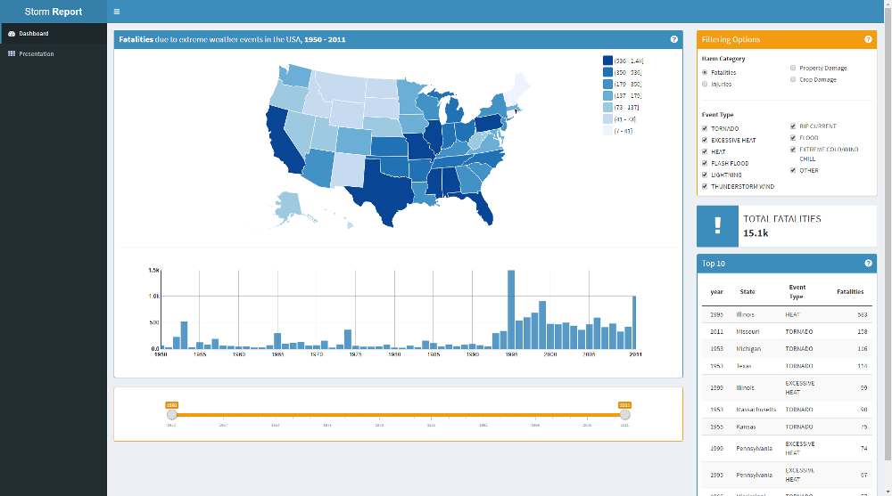

## Introduction 

The idea for this Shiny app came from the Reproducible Research project:

+ measure the impact of severe wheather events on public health and ecomomy in the US
+ based on the analysis of the USA Storm Database

This app aims to provide a **visual exploration of the USA Storm Database**:

+ impact of severe wheather events by state / by year
+ list of the most impactful events 

The user should also be able offered several filtering options to navigate the Database content more easily.

--- .class #id 

## App overview

This is what the app looks like:

The filtering options are in yellow boxes, results are in the blue ones. Small help snippets are available when hovering on the question marks in the top right corner of each box.

A more thorough presentation page is also available via the sidebar.  

--- .class #id 

## Details

The user can filter the data along three axes:

+ the Harm Category: impact on public health and ecomomy
+ the Event Types:
    + for clarity reasons, only the top 10 are listed (48 in total)
    + the top 10 depends on the Harm Category
+ the Year Range: any period between 1950 and 2011

The displayed results are updated automatically based on the user's choices. For the year histogram, years outside of the selected range will be greyed out but still displayed.

--- .class #id 

## Data Processing

The main data processing is the same I used for the Reproducible Research project. More information about it can be found in the report I published on rPubs [here](http://rpubs.com/paulwasit/weatherEventsUS).

It produces a dataframe that is still quite large (approx. 200k observations), as it keeps all harmful events. In order to quicken the plots rendering, I also went further & created new dataframes for each Harm Category: they group all events sharing the same Event Type by state & by year.

These dataframes are perfectly suited to the plot rendering and are much smaller, with approx. 5k observations each.

The large dataframe is only used for the Top 10 table, which is build using reasonably inexpensive computation.

--- .class #id 

## Final comments & Future improvements

The full app is available on Github [here](). A few tricky/interesting facts:

+ nPlot histogram bars can be colored individually by creating plot$params$data$color <- c(hexColors), where plot <- nPlot(...)
+ rMaps are not responsive by default but it can be done via css (see my solution on Github)
+ rCharts are not responsive by default, but it is possible to use this [SO trick](http://stackoverflow.com/questions/25371860/automatically-resize-rchart-in-shiny). The issue is that the custom width & height are attributed to the .rChart class, so it is not possible to customize each rChart individually (at least to my knowledge)

Possible improvements:

+ create a focus by state when the user clicks on the US map
+ add an additional histogram indicating the total harm per event type (it is not so hard, but due to rChart limitations on size mentioned above, I was not able to do it properly) 
+ the majority of events include GPS coordinates, so it could be possible to display their location on the map, as dots with varying radius based on their intensity

